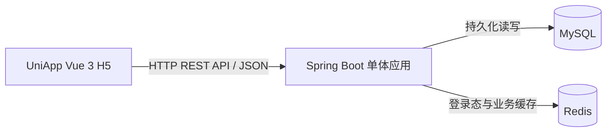

# 系统架构设计

## 1. 设计状态与依据

本文件同时说明当前实现和后续设计。阶段 1–8 的开发及真实验收均已完成（2026-09-20），涵盖后端基础、认证、Habit 管理、打卡、连续天数和 Redis 业务缓存；Phase 9 第一阶段的前端登录闭环、真实联调及 CORS 验证已完成；Habit 列表与创建已完成真实联调；今日状态、打卡和连续天数前端已实现，第三阶段真实浏览器验收已完成；最终交付按后续计划推进。开发应遵循根目录 `AGENTS.md` 及相关文档。

后端使用 Java 21 + Spring Boot；前端使用 UniApp + Vue 3，并以 H5 作为演示目标。

习惯名称规则：不同用户允许同名，同一用户内名称唯一。业务层先 trim，数据库通过 `uk_habits_user_name(user_id, name)` 兜底；同用户重名创建返回 HTTP 409 / `40901`。

## 2. 整体架构



采用前后端分离的单体架构：一个前端、一个 Spring Boot 后端、一个 MySQL 数据库和一个 Redis 服务即可。后端由 Maven 管理依赖，前端使用项目对应的 npm 依赖管理方式并提交锁文件。

本期不引入微服务、消息队列、分布式事务、API 网关、事件驱动架构或复杂领域模型。

## 3. 职责与目录规划

| 层次 | 职责 | 不承担的职责 |
| --- | --- | --- |
| UniApp 页面 | 登录、创建表单、列表、打卡按钮及结果展示 | 自行计算连续天数或伪造打卡成功 |
| 前端统一请求层 | 基础 URL、Authorization、JSON 解析、公共错误处理、401 后清理登录态 | 决定用户身份或业务日期 |
| 后端身份过滤器/拦截器 | 读取 Redis 会话并构造当前用户上下文 | 信任客户端传入的 userId |
| Controller | 接收请求、参数校验、调用 Service、返回统一 DTO | SQL、日期算法及复杂业务逻辑 |
| Service | 权限归属、业务日期、事务、幂等、连续天数、缓存处理 | 页面展示逻辑 |
| Mapper（MyBatis） | 参数化 SQL、用户范围查询、插入、日期排序查询 | 身份认证和业务规则 |
| Redis 访问组件 | 会话和业务缓存读写、TTL、缓存失效 | 代替 MySQL 持久化业务记录 |
| 全局异常处理 | 统一 HTTP 状态和 `code/message/data` | 向客户端泄露 SQL、密码或堆栈 |

异常映射依据错误来源：业务层直接指定 ErrorCode；Spring MVC 使用具体异常类型选择错误码；Redis 会话边界指定 50301，数据库可用性异常指定 50302。ErrorCode 仅提供到 HTTP 状态的正向转换。无法识别原因的异常统一为 50001，不依据通用 HTTP 401/404/503 猜业务语义。

GlobalExceptionHandler 保留 ResponseEntityExceptionHandler 的具体异常注册与协议头，在统一出口按类型映射；不重复注册父类异常。容器 `/error` 仅对无异常的 404 保留路由语义，其余未知分派安全回退。未知错误日志保留类型和堆栈位置，不打印可能携带敏感信息的异常原文。未分类唯一约束冲突继续返回 50001，由后续业务 Service 识别具体约束，不能全局映射为习惯重名。

后续目录规划：

```text
interview_checkin-app/
├── backend/
├── frontend/
├── database/
│   └── init.sql
├── docs/
├── AGENTS.md
├── ARCHITECTURE.md
└── README.md
```

其中后端采用简单清晰的 `controller / service / mapper / dto / model / config / exception` 分层，不增加无必要的中间层。

## 4. 核心请求流程

### 4.1 登录

校验输入 → MySQL 查询用户 → BCrypt 验证密码 → 生成随机不透明 Token → Redis 写入带 TTL 的会话 → 返回 Token。

Redis 会话写入失败时不得返回登录成功。

当前实现由 AuthController → AuthServiceImpl → UserMapper / SessionServiceImpl 完成。用户名 trim 后按 Locale.ROOT 转小写，密码不 trim。会话值为用户 ID 字符串，固定 TTL，不滑动续期。登录响应包含 token、tokenType、expiresIn 和 user，用户 ID 为字符串。登录校验用户名范围及密码 UTF-8 字节数；演示账户通过独立 SQL 手工准备。

受保护请求由 AuthInterceptor 查询 Redis，将身份写入本次 HttpServletRequest 属性；`GET /auth/me` 再查询 MySQL 返回安全用户字段。`POST /auth/logout` 删除当前令牌对应的会话，其他令牌不受影响；重复登出被拦截并返回 401。拦截器还通过认证服务确认 MySQL 用户存在，否则撤销当前会话。Redis 会话数据访问故障统一为 50301。H5 CORS 已由 WebMvcConfig 配置；OPTIONS 不进行 Session 认证，真实业务请求仍须认证。

### 4.2 每日打卡（提交已实现）

鉴权 → 校验习惯归属 → 读取业务日期 → 查询已有记录 → 无记录时插入 → 唯一键冲突回查 → 返回记录。当前无 Service 级事务注解，Mapper 操作按现有事务环境执行；无外层事务时独立提交。首次、重复及冲突回查成功后，均尝试失效当日 today/streak 缓存。已改为单次读取 Instant；重复键异常按目标记录回查，不再解析消息或索引名，见 API.md 第 5 节。

每日打卡接口采用：

```http
PUT /api/v1/habits/{habitId}/checkins/today
```

同一用户、同一习惯、同一业务日期内重复调用是幂等的：首次返回新记录且 created=true，重复调用返回原记录且 created=false；数据库唯一约束保证最多一条记录，Service + MySQL 并发已验证，真实 HTTP 鉴权并发也已验收完成。

今日状态 GET 返回 {checkedIn}；连续天数 GET 返回 {streak}，两者先校验归属再查询 MySQL。连续天数根据倒序日期从今天或昨天起逐日递减，遇到断签停止。两个查询均先查习惯归属，再查 Redis，Miss 时从 MySQL 读取并回填。

### 4.3 业务缓存查询（已完成真实验收）

鉴权及资源归属校验 → 查询 Redis 业务缓存 → Cache Miss 时查询 MySQL → 回填短 TTL 缓存 → 返回结果。

Redis 业务缓存只是性能优化；MySQL 始终是业务事实来源。登录会话不能从 MySQL 自动恢复，Redis 中会话不存在时必须重新登录。

## 5. 时间、身份与安全约定

身份及密码规则已用于认证模块；Clock、业务日期和资源归属已用于打卡提交。H5 Token 存储与 CORS 已用于前端登录闭环。

- 全局业务时区固定为 `Asia/Shanghai`，通过 `APP_BUSINESS_ZONE` 配置；有业务数据后不能随意修改该语义。
- 后端使用可注入 `Clock` 获取时间；一次业务请求只确定一次业务日期 D。
- `checkin_date` 存业务 `DATE`；`created_at`、`updated_at`、`checked_in_at` 等时间戳按 UTC 写入。
- 连续天数以今天或昨天为锚点，按 `LocalDate` 的自然日关系计算，不使用“24 小时毫秒差”判断相邻日期。
- Token 使用密码学安全随机值，通过 `Authorization: Bearer <token>` 传递；日志不得记录完整 Token。
- Redis Session Key 使用 Token 的 SHA-256 摘要，不直接使用明文 Token 作为 Key。
- 当前用户身份只能来自服务端会话；业务请求不接受客户端指定 `userId`。
- 他人资源与不存在资源统一返回 404，避免泄露资源归属。
- 密码使用 BCrypt 哈希存储；禁止明文、可逆加密或普通摘要替代密码哈希。
- H5 Token 通过 UniApp 同步 storage API 存储，统一键为 `checkin.auth.token`，由 `src/utils/auth.js` 管理；部署环境使用 HTTPS，开发 CORS 仅允许配置的前端来源。

## 6. 配置约定

| 环境变量 | 用途/默认策略 |
| --- | --- |
| `DB_URL`、`DB_USERNAME`、`DB_PASSWORD` | MySQL 连接；真实密码不得写入源码 |
| `REDIS_HOST`、`REDIS_PORT` | 已接入；地址默认 localhost，端口默认 6379 |
| `SPRING_DATA_REDIS_DATABASE` | Spring 标准环境变量，库默认 0；未映射简写 REDIS_DATABASE |
| `SPRING_DATA_REDIS_USERNAME`、`SPRING_DATA_REDIS_PASSWORD` | Spring 标准 Redis 认证配置；未映射简写 REDIS_USERNAME / REDIS_PASSWORD |
| `APP_BUSINESS_ZONE` | 已接入：默认 `Asia/Shanghai`，配置 app.business-zone，供业务 Clock 使用 |
| `SESSION_TTL_SECONDS` | 当前 YAML 显式映射至 app.session.ttl-seconds，默认 7200 秒，须为正数；固定过期 |
| `APP_CACHE_TTL_SECONDS` | 已接入：默认 30 秒，上限为下一业务日零点 |
| `APP_CORS_ALLOWED_ORIGIN` | 已接入 app.cors.allowed-origin，默认 http://localhost:5173 |
| `SERVER_PORT` | 默认 8080 |
| 前端 API 基础地址 | 当前集中定义在 src/api/request.js：http://localhost:8080/api/v1；未接入 VITE_API_BASE_URL |
| `SPRING_PROFILES_ACTIVE` | 当前默认 local；可在运行环境覆盖 |

演示账户来自可选的 `database/demo-data.sql`，不由应用启动创建。真实本地配置位于 `backend/config/application-local.yml`，示例可提交，真实文件不提交、不打包；从 backend 工作目录读取外部配置。业务时区和业务缓存已接入；CORS 已接入环境变量，前端基础地址集中在 request.js。

配置由运行环境注入，命令行和 IDEA 配置方式见 [README](README.md)。仓库只提供不含真实凭证的配置示例。

## 7. Redis 与一致性边界

MySQL 是最终业务数据来源；Redis 只承担服务端登录态和查询缓存。

业务缓存采用简单的 Cache-Aside：

1. 查询优先读 Redis，Miss 时回源 MySQL 并写入短 TTL 缓存。
2. 每日打卡以 MySQL 事务成功提交为准。
3. MySQL 提交成功后删除对应 `today` 和 `streak` 缓存。
4. 缓存删除失败时记录日志，不回滚已经成功的 MySQL 事务，由短 TTL 最终收敛。
5. 已完成鉴权的请求若仅业务缓存不可用，可以直接查询 MySQL。
6. Redis 会话不可用或无法完成鉴权时，不得绕过认证，应返回服务不可用或未登录结果。

本期不实现复杂的缓存并发控制协议、分布式锁或跨 MySQL/Redis 强一致事务。

相关文档：`docs/REQUIREMENTS.md`、`docs/DATABASE.md`、`docs/API.md`、`docs/IMPLEMENTATION_PLAN.md`、`docs/TEST_PLAN.md`。


## 8. 可选加分项：用户注册（主线完成后最后做）

注册仅作为 Phase 1–11 主线全部完成后最后考虑的可选加分项，不影响主线交付和验收。若单独授权实施：请求 DTO → Service 校验与 BCrypt → Mapper 写入 users，由用户名唯一约束保证并发安全。不使用启动回调创建用户。是否公开放行、是否注册后创建 Redis Session 在实施前确定；自动登录若被采用，必须明确 MySQL 已提交而 Session 写入失败时的行为。具体规划见 IMPLEMENTATION_PLAN.md 第 6 节。

## 9. 前端 Habit 列表与创建（已实现）

习惯主页保留 /auth/me 和退出登录，通过 src/api/habit.js → request.js → uni.request 调用 GET/POST /habits。列表状态、分页与创建表单使用 Vue ref 管理，不引入状态管理库。分页只使用后端 items/total/page/pageSize；Habit ID 保持字符串。创建成功重新查询第一页，不做乐观插入；重名按 code=40901 处理，401 沿用清 Token 与返回登录页流程。

Vite 开发端口固定为 5173，strictPort=true，避免自动换端口导致 Origin 与后端 CORS 不匹配。列表、分页、创建及重名提示已完成真实联调；今日状态、打卡和 streak 前端已实现，第三阶段真实浏览器验收已完成。

## 10. 今日状态、打卡与连续天数前端（已实现）

习惯主页通过 habit.js 的 getTodayStatus、checkinToday、getStreak 复用统一 request 层。列表成功后为每条字符串 Habit ID 建立独立状态，today 与 streak 分别维护值、loading 和 error；不增加后端聚合接口。页版本与卡片查询版本用于忽略过期响应，退出页面后停止更新。

PUT 返回 created=true/false 均触发两个 GET 重新同步，页面只展示服务器状态；同步失败保留卡片和操作提示，不用旧值伪装最新结果。按钮防重复点击仅改善体验，幂等仍由后端和数据库唯一约束保障。未引入 Pinia、Axios 或新后端逻辑；收尾阶段已新增独立 Vitest 纯 JS 测试。

## 11. 前端收尾与轻量测试

Node.js 24.19.0 / npm 11.17.0；Vitest 与现有 Vite 5 兼容，独立 vitest.config.mjs 仅运行 tests 下的 Node 环境测试，不加载 UniApp 插件。测试以 globalThis.uni 替身覆盖 auth 存储、request 协议判断与 API 路径参数，不访问真实服务。保留 frontend/shims-uni.d.ts，移除重复的 src/shime-uni.d.ts。

refreshCheckin 仅在当前页、当前轮 today/streak 均同步成功后清除陈旧 actionError；部分失败或旧请求不能清除提示。真实浏览器已验收 today/streak、首次及重复 PUT、写后同步、刷新持久化、分页 ID 对应与 logout。
