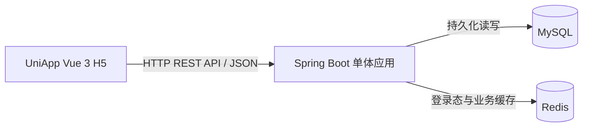

# 系统架构设计

## 1. 设计状态与依据

本文件同时说明当前实现和后续设计。阶段 1–3 已具备；阶段 4 已新增登录、当前用户查询、登出及 Redis Session 代码，尚未完成验收。习惯、打卡及前端仍为后续设计；开发应遵循根目录 `AGENTS.md` 及相关文档。

后端使用 Java 21 + Spring Boot；前端使用 UniApp + Vue 3，并以 H5 作为演示目标。

习惯名称规则：不同用户允许同名，同一用户内名称唯一。业务层先 trim，数据库通过 `uk_habits_user_name(user_id, name)` 兜底；同用户重名创建返回 HTTP 409 / `40901`。

## 2. 整体架构



采用前后端分离的单体架构：一个前端、一个 Spring Boot 后端、一个 MySQL 数据库和一个 Redis 服务即可。后端由 Maven 管理依赖，前端使用项目对应的 npm 依赖管理方式并提交锁文件。

本期不引入微服务、消息队列、分布式事务、API 网关、事件驱动架构或复杂领域模型。

## 3. 职责与目录规划

| 层次 | 职责 | 不承担的职责 |
| --- | --- | --- |
| UniApp 页面 | 登录、创建表单、列表、打卡按钮及结果展示 | 自行计算连续天数或伪造打卡成功 |
| 前端统一请求层 | 基础 URL、Authorization、JSON 解析、公共错误处理、401 后清理登录态 | 决定用户身份或业务日期 |
| 后端身份过滤器/拦截器 | 读取 Redis 会话并构造当前用户上下文 | 信任客户端传入的 userId |
| Controller | 接收请求、参数校验、调用 Service、返回统一 DTO | SQL、日期算法及复杂业务逻辑 |
| Service | 权限归属、业务日期、事务、幂等、连续天数、缓存处理 | 页面展示逻辑 |
| Mapper（MyBatis） | 参数化 SQL、用户范围查询、插入、日期排序查询 | 身份认证和业务规则 |
| Redis 访问组件 | 会话和业务缓存读写、TTL、缓存失效 | 代替 MySQL 持久化业务记录 |
| 全局异常处理 | 统一 HTTP 状态和 `code/message/data` | 向客户端泄露 SQL、密码或堆栈 |

后续目录规划：

```text
interview_checkin-app/
├── backend/
├── frontend/
├── database/
│   └── init.sql
├── docs/
├── AGENTS.md
├── ARCHITECTURE.md
└── README.md
```

其中后端采用简单清晰的 `controller / service / mapper / dto / model / config / exception` 分层，不增加无必要的中间层。

## 4. 核心请求流程

### 4.1 登录

校验输入 → MySQL 查询用户 → BCrypt 验证密码 → 生成随机不透明 Token → Redis 写入带 TTL 的会话 → 返回 Token。

Redis 会话写入失败时不得返回登录成功。

当前实现由 AuthController → AuthServiceImpl → UserMapper / SessionServiceImpl 完成。用户名 trim 后按 Locale.ROOT 转小写，密码不 trim。会话值为用户 ID 字符串，固定 TTL，不滑动续期。登录响应目前只含 token，其他目标字段和完整输入校验尚未补齐。

受保护请求由 AuthInterceptor 查询 Redis，将身份写入本次 HttpServletRequest 属性；`GET /auth/me` 再查询 MySQL 返回安全用户字段。`POST /auth/logout` 删除当前令牌对应的会话，其他令牌不受影响；重复登出被拦截并返回 401。拦截器只验证会话，不校验 MySQL 用户是否仍存在；用户不存在时的会话清理、Redis 专用错误码映射及 H5 跨域配置尚待完善。

### 4.2 每日打卡

鉴权 → 捕获一次业务日期 D → 校验习惯属于当前用户 → MySQL 事务尝试插入 → 数据库唯一约束兜底 → 提交成功后删除今日状态与连续天数缓存 → 基于 MySQL 真实数据构造响应 → 前端展示。

每日打卡接口采用：

```http
PUT /api/v1/habits/{habitId}/checkins/today
```

同一用户、同一习惯、同一业务日期内重复调用是幂等的：首次 `created=true`，重复调用 `created=false`，数据库始终最多一条记录。

### 4.3 查询

鉴权及资源归属校验 → 查询 Redis 业务缓存 → Cache Miss 时查询 MySQL → 回填短 TTL 缓存 → 返回结果。

Redis 业务缓存只是性能优化；MySQL 始终是业务事实来源。登录会话不能从 MySQL 自动恢复，Redis 中会话不存在时必须重新登录。

## 5. 时间、身份与安全

- 全局业务时区固定为 `Asia/Shanghai`，通过 `APP_BUSINESS_ZONE` 配置；有业务数据后不能随意修改该语义。
- 后端使用可注入 `Clock` 获取时间；一次业务请求只确定一次业务日期 D。
- `checkin_date` 存业务 `DATE`；`created_at`、`updated_at`、`checked_in_at` 等时间戳按 UTC 写入。
- 连续天数以今天或昨天为锚点，按 `LocalDate` 的自然日关系计算，不使用“24 小时毫秒差”判断相邻日期。
- Token 使用密码学安全随机值，通过 `Authorization: Bearer <token>` 传递；日志不得记录完整 Token。
- Redis Session Key 使用 Token 的 SHA-256 摘要，不直接使用明文 Token 作为 Key。
- 当前用户身份只能来自服务端会话；业务请求不接受客户端指定 `userId`。
- 他人资源与不存在资源统一返回 404，避免泄露资源归属。
- 密码使用 BCrypt 哈希存储；禁止明文、可逆加密或普通摘要替代密码哈希。
- H5 Token 暂存 `sessionStorage`；部署环境使用 HTTPS，开发 CORS 仅允许配置的前端来源。

## 6. 配置约定

| 环境变量 | 用途/默认策略 |
| --- | --- |
| `DB_URL`、`DB_USERNAME`、`DB_PASSWORD` | MySQL 连接；真实密码不得写入源码 |
| `REDIS_HOST`、`REDIS_PORT` | 已接入；地址默认 localhost，端口默认 6379 |
| `SPRING_DATA_REDIS_DATABASE` | Spring 标准环境变量，库默认 0；未映射简写 REDIS_DATABASE |
| `SPRING_DATA_REDIS_USERNAME`、`SPRING_DATA_REDIS_PASSWORD` | Spring 标准 Redis 认证配置；未映射简写 REDIS_USERNAME / REDIS_PASSWORD |
| `APP_BUSINESS_ZONE` | 默认 `Asia/Shanghai` |
| `SESSION_TTL_SECONDS` | 当前 YAML 显式映射至 app.session.ttl-seconds，默认 7200 秒，须为正数；固定过期 |
| `APP_CACHE_TTL_SECONDS` | 业务缓存短 TTL，默认 30 秒 |
| `CORS_ALLOWED_ORIGINS` | 显式允许的 H5 Origin |
| `SERVER_PORT` | 默认 8080 |
| `VITE_API_BASE_URL` | 前端 API 基础地址 |
| `SPRING_PROFILES_ACTIVE` | 当前默认 local；可在运行环境覆盖 |

演示账户当前直接读取配置属性 `app.demo-user.username`、`app.demo-user.password`，未映射原规划的 `DEMO_USERNAME`、`DEMO_PASSWORD`。可在被 Git 忽略的本地配置中提供；两者非空白时启动即尝试初始化，不存在则写入 BCrypt 密码哈希与 UTC 时间，已存在则跳过。没有独立初始化开关或环境限制，测试环境应留空凭证。业务时区、业务缓存、CORS 和前端配置仍为规划项，不代表已经接入运行逻辑。

配置由运行环境注入。后续 README 必须明确说明命令行或 IDEA 中如何提供环境变量；仓库只提供不含真实凭证的配置示例。

## 7. Redis 与一致性边界

MySQL 是最终业务数据来源；Redis 只承担服务端登录态和查询缓存。

业务缓存采用简单的 Cache-Aside：

1. 查询优先读 Redis，Miss 时回源 MySQL 并写入短 TTL 缓存。
2. 每日打卡以 MySQL 事务成功提交为准。
3. MySQL 提交成功后删除对应 `today` 和 `streak` 缓存。
4. 缓存删除失败时记录日志，不回滚已经成功的 MySQL 事务，由短 TTL 最终收敛。
5. 已完成鉴权的请求若仅业务缓存不可用，可以直接查询 MySQL。
6. Redis 会话不可用或无法完成鉴权时，不得绕过认证，应返回服务不可用或未登录结果。

本期不实现复杂的缓存并发控制协议、分布式锁或跨 MySQL/Redis 强一致事务。

相关文档：`docs/REQUIREMENTS.md`、`docs/DATABASE.md`、`docs/API.md`、`docs/IMPLEMENTATION_PLAN.md`、`docs/TEST_PLAN.md`。
