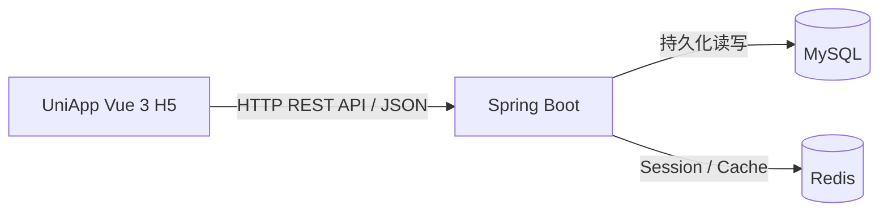

# interview_checkin-app

基于 **UniApp + Vue 3 + Spring Boot + MySQL + Redis** 的全栈习惯打卡应用。

项目重点不是“功能堆叠”，而是把一个小型全栈业务闭环做完整：真实登录态、服务端身份、数据库持久化、并发安全打卡、业务时区、连续打卡计算、Redis Session / Cache-Aside、统一错误响应以及真实前后端联调。

---

## 5 分钟快速启动

> 适用于本机已经安装好以下环境的情况：
>
> - JDK 21
> - MySQL 8.0+
> - Redis 或 Memurai
> - Node.js 24.x / npm
>
> 默认端口：
>
> - 后端：`http://localhost:8080`
> - 前端：`http://localhost:5173`
> - MySQL：`3306`
> - Redis：`6379`

### 1. 初始化 MySQL

执行：

```text
database/create-database.sql
```

切换到 `checkin` 数据库后，依次执行：

```text
database/init.sql
database/demo-data.sql
```

`demo-data.sql` 会准备本地演示账户：

```text
用户名：demo_user
密码：DemoOnly123!
```

> `demo-data.sql` 只保存 BCrypt 哈希，不保存明文密码。  
> 如果数据库中已存在 `demo_user`，脚本不会覆盖原密码。

### 2. 启动 Redis / Memurai

保证 Redis 可访问：

```text
localhost:6379
```

如果本机安装了 `redis-cli`，可以检查：

```powershell
redis-cli ping
```

正常应返回：

```text
PONG
```

### 3. 启动后端

在仓库根目录打开 PowerShell：

```powershell
cd backend

$env:DB_URL = 'jdbc:mysql://<数据库地址>:<端口>/<数据库名>?connectionTimeZone=UTC&forceConnectionTimeZoneToSession=true'
$env:DB_USERNAME = '你的MySQL用户名'
$env:DB_PASSWORD = '你的MySQL密码'

.\mvnw.cmd spring-boot:run
```
> 例如：MySQL 在本机 3306，数据库名为 checkin  
> $env:DB_URL = 'jdbc:mysql://localhost:3306/checkin?connectionTimeZone=UTC&forceConnectionTimeZoneToSession=true'

看到类似：

```text
Started CheckinApplication
```

说明后端启动成功。

> 后端默认监听 `http://localhost:8080`。  
> 建议从 `backend/` 目录启动，因为 Spring Boot 会从 `./config/` 查找外部本地配置。

### 4. 启动前端

另开一个终端：

```powershell
cd frontend
npm ci
npm run dev:h5
```

浏览器访问：

```text
http://localhost:5173/
```

### 5. 登录并体验完整业务

使用：

```text
用户名：demo_user
密码：DemoOnly123!
```

登录后可以完成：

```text
创建 Habit
→ 查看分页列表
→ 今日打卡
→ 查看今日状态
→ 查看连续打卡天数
→ 刷新页面验证持久化
→ 退出登录
```

---

## 当前实现

已完成的主线功能：

- Spring Boot 后端项目与 Maven Wrapper
- MySQL 三表持久化
- 统一 API 响应与异常处理
- BCrypt 登录认证
- Redis Session
- 当前用户查询与退出登录
- Habit 创建、同用户重名限制与分页
- 每日打卡
- 重复打卡幂等
- MySQL 唯一约束并发安全
- 今日打卡状态
- 连续打卡天数
- Redis today / streak 短 TTL 业务缓存
- UniApp + Vue 3 H5 前端
- 前后端真实联调
- CORS
- 前端 Vitest
- 后端普通测试与真实 MySQL 集成测试

当前主线不实现注册。注册仅保留为可选扩展，不影响项目完整运行与验收。

---

## 技术栈

### 后端

- Java 21
- Spring Boot 4.1.1
- Maven Wrapper 3.9.11
- MyBatis Spring Boot Starter 4.1.0
- MySQL 8.0+
- Redis / Memurai
- BCrypt

### 前端

- UniApp
- Vue 3
- Vite H5
- Vitest

本机最终验证环境：

```text
Microsoft JDK 21.0.12.1
Node.js 24.19.0
npm 11.17.0
```

---

## 系统架构



采用简单的前后端分离单体架构：

- 前端只负责交互和展示
- 后端负责身份、业务日期、权限、幂等和连续天数
- MySQL 是业务事实来源
- Redis 用于登录会话和查询缓存
- 不引入微服务、消息队列、分布式事务或 API Gateway

---

## 项目目录

```text
interview_checkin-app/
├── backend/
│   ├── config/
│   │   └── application-local.example.yml
│   ├── src/
│   ├── pom.xml
│   ├── mvnw
│   └── mvnw.cmd
├── frontend/
│   ├── src/
│   ├── tests/
│   ├── package.json
│   ├── package-lock.json
│   └── vitest.config.mjs
├── database/
│   ├── init.sql
│   └── demo-data.sql
├── docs/
│   ├── API.md
│   ├── DATABASE.md
│   ├── IMPLEMENTATION_PLAN.md
│   ├── REQUIREMENTS.md
│   └── TEST_PLAN.md
├── AGENTS.md
├── ARCHITECTURE.md
└── README.md
```

---

## 后端配置

配置可以通过两种方式提供：

1. 环境变量
2. `backend/config/application-local.yml`

项目不会自动加载 `.env`。

### 主要环境变量

| 变量 | 默认值 | 用途 |
| --- | --- | --- |
| `DB_URL` | 无 | MySQL JDBC URL |
| `DB_USERNAME` | 无 | MySQL 用户名 |
| `DB_PASSWORD` | 无 | MySQL 密码 |
| `REDIS_HOST` | `localhost` | Redis 地址 |
| `REDIS_PORT` | `6379` | Redis 端口 |
| `SESSION_TTL_SECONDS` | `7200` | Session 固定 TTL |
| `APP_CACHE_TTL_SECONDS` | `30` | today/streak 缓存 TTL 上限 |
| `APP_BUSINESS_ZONE` | `Asia/Shanghai` | 业务时区 |
| `APP_CORS_ALLOWED_ORIGIN` | `http://localhost:5173` | H5 CORS Origin |
| `SERVER_PORT` | `8080` | 后端端口 |
| `SPRING_PROFILES_ACTIVE` | `local` | Spring Profile |

Redis 用户名、密码和数据库编号可以使用 Spring 标准配置：

```text
SPRING_DATA_REDIS_USERNAME
SPRING_DATA_REDIS_PASSWORD
SPRING_DATA_REDIS_DATABASE
```

### 本地配置文件

可复制：

```text
backend/config/application-local.example.yml
```

为：

```text
backend/config/application-local.yml
```

再填写个人数据库配置。

真实 `application-local.yml`：

- 已由 Git 忽略
- 不应提交
- 不应放入最终交付压缩包
- 不参与 Maven JAR 打包

---

## 后端详细启动方式

### Windows PowerShell

```powershell
cd backend

$env:JAVA_HOME = 'C:\path\to\jdk-21'
$env:Path = "$env:JAVA_HOME\bin;$env:Path"

$env:DB_URL = 'jdbc:mysql://localhost:3306/checkin?connectionTimeZone=UTC&forceConnectionTimeZoneToSession=true'
$env:DB_USERNAME = '你的MySQL用户名'
$env:DB_PASSWORD = '你的MySQL密码'

.\mvnw.cmd spring-boot:run
```

### 构建后运行 JAR

```powershell
cd backend
.\mvnw.cmd clean package
java -jar target/checkin-0.0.1-SNAPSHOT.jar
```

### macOS / Linux

在 `backend/` 目录：

```bash
sh ./mvnw clean verify
sh ./mvnw spring-boot:run
```

---

## IDEA 启动

在 IntelliJ IDEA 中：

- 将 `backend/pom.xml` 导入为 Maven 项目
- Project SDK 使用 JDK 21
- Maven JDK 使用 JDK 21
- Run Configuration 主类：
  `com.example.checkin.CheckinApplication`
- Working directory：
  `backend/`

如果使用外部本地配置，Working directory 必须正确，否则 Spring Boot 可能找不到：

```text
backend/config/application-local.yml
```

---

## MySQL 初始化

项目不会自动建库、建表，也不会在启动时自动插入演示账户。

先创建数据库：

```sql
CREATE DATABASE checkin
CHARACTER SET utf8mb4
COLLATE utf8mb4_0900_ai_ci;

USE checkin;
```

然后执行：

```text
database/init.sql
```

该脚本创建：

```text
users
habits
checkin_records
```

再按需执行：

```text
database/demo-data.sql
```

准备公开演示账号。

---

## 演示账户

```text
用户名：demo_user
密码：DemoOnly123!
```

该账户仅用于本地演示，不应在生产环境复用。

---

## 认证设计

### 登录

```http
POST /api/v1/auth/login
```

成功返回：

```json
{
  "code": 0,
  "message": "ok",
  "data": {
    "token": "...",
    "tokenType": "Bearer",
    "expiresIn": 7200,
    "user": {
      "id": "1",
      "username": "demo_user"
    }
  }
}
```

### 当前用户

```http
GET /api/v1/auth/me
Authorization: Bearer <token>
```

### 登出

```http
POST /api/v1/auth/logout
Authorization: Bearer <token>
```

Token 为随机不透明值。

Redis Session Key：

```text
checkin:v1:session:{tokenSha256}
```

Redis 中不直接使用完整 Token 作为 Key。

Session 默认固定 TTL 为：

```text
7200 秒
```

普通读取不会滑动续期。

---

## Habit API

### 创建 Habit

```http
POST /api/v1/habits
```

请求：

```json
{
  "name": "每天阅读",
  "description": "阅读 30 分钟"
}
```

规则：

- name 必填
- name 最多 50 个 Unicode 码点
- description 最多 200 个 Unicode 码点
- 同一用户不能创建同名 Habit
- 不同用户允许同名

同用户重名返回：

```text
HTTP 409
code = 40901
```

### Habit 分页

```http
GET /api/v1/habits?page=1&pageSize=20
```

返回：

```text
items
total
page
pageSize
```

Habit ID 在 API 和前端始终按字符串处理，避免 JavaScript 大整数精度问题。

---

## 每日打卡

### 今日打卡

```http
PUT /api/v1/habits/{habitId}/checkins/today
```

首次：

```json
{
  "code": 0,
  "message": "ok",
  "data": {
    "id": "1",
    "habitId": "1",
    "checkinDate": "2026-09-20",
    "checkedInAt": "2026-09-20T10:49:05.395Z",
    "created": true
  }
}
```

同一业务日重复请求仍返回成功，但：

```json
{
  "created": false
}
```

因此接口具有幂等语义。

数据库通过唯一约束：

```text
(user_id, habit_id, checkin_date)
```

保证同一用户、同一 Habit、同一业务日最多一条记录。

---

## 今日状态与连续天数

### 今日状态

```http
GET /api/v1/habits/{habitId}/checkins/today
```

响应核心字段：

```json
{
  "checkedIn": true
}
```

### 连续打卡

```http
GET /api/v1/habits/{habitId}/streak
```

响应核心字段：

```json
{
  "streak": 3
}
```

连续天数由后端计算，前端不会自行 `streak++`。

规则：

- 今天已打卡：从今天向前计算
- 今天未打卡但昨天已打卡：保留截至昨天的连续天数
- 遇到断签立即停止
- 使用 `LocalDate`
- 不使用“24 小时毫秒差”判断自然日连续关系

---

## 时间规则

项目明确区分：

```text
业务日期
```

和：

```text
绝对时间戳
```

### 业务日期

默认业务时区：

```text
Asia/Shanghai
```

例如：

```text
checkinDate = 2026-09-20
```

### 时间戳

统一按 UTC 返回，例如：

```text
2026-09-20T10:49:05.395Z
```

其中 `Z` 表示 UTC。

前端展示时可转换为本地时间。

---

## Redis 设计

MySQL 始终是业务事实来源。

Redis 只承担：

1. 登录 Session
2. today / streak 查询缓存

业务缓存采用 Cache-Aside。

### Key

Session：

```text
checkin:v1:session:{tokenSha256}
```

today：

```text
checkin:v1:today:{uid}:{hid}:{D}
```

streak：

```text
checkin:v1:streak:{uid}:{hid}:{D}
```

### 缓存规则

- 默认 TTL：30 秒
- 实际 TTL 不超过下一业务日零点
- Cache Miss 回源 MySQL
- 打卡成功后删除对应 today / streak 缓存
- 业务缓存读取失败时可回退 MySQL
- Redis Session 不可用时不能绕过身份认证
- MySQL 是最终事实来源
- 当前方案是短 TTL 最终一致性，不保证 Redis / MySQL 强一致

---

## 前端启动

在仓库根目录：

```powershell
cd frontend
npm ci
npm run dev:h5
```

访问：

```text
http://localhost:5173/
```

Vite 固定：

```text
port = 5173
strictPort = true
```

如果 5173 被占用，开发服务器会直接启动失败，不会自动切换到 5174。

这是为了避免前端 Origin 改变后与后端 CORS 配置不一致。

前端 API 基础地址当前集中在：

```text
frontend/src/api/request.js
```

默认：

```text
http://localhost:8080/api/v1
```

---

## 前端行为

前端通过 `uni.request` 统一请求后端。

统一请求层负责：

- API 基础地址
- Bearer Token
- HTTP / 业务 code 判断
- 401 清理 Token
- 网络错误结构化处理

页面负责：

- 登录
- 当前用户
- Habit 列表
- Habit 创建
- 分页
- 今日状态
- streak
- 今日打卡
- 错误与重试
- logout

前端不会：

- 信任或发送客户端 userId 决定身份
- 自己决定业务日期
- 自己计算 streak
- 乐观伪造打卡成功
- 将 Habit ID 转成 JavaScript Number

---

## CORS

开发环境默认只允许：

```text
http://localhost:5173
```

对应配置：

```text
APP_CORS_ALLOWED_ORIGIN
```

后端允许 `/api/v1/**` 的：

```text
GET
POST
PUT
DELETE
OPTIONS
```

常用请求头：

```text
Authorization
Content-Type
```

OPTIONS 预检不进行 Session 身份认证，但真实业务请求仍必须认证。

---

## API 响应规范

成功：

```json
{
  "code": 0,
  "message": "ok",
  "data": {}
}
```

失败：

```json
{
  "code": 40101,
  "message": "...",
  "data": null
}
```

主要错误码：

| code | 含义 |
| --- | --- |
| `40001` | 参数错误 |
| `40101` | 未登录 / Session 无效 |
| `40102` | 用户名或密码错误 |
| `40400` | 路由不存在 |
| `40401` | Habit 不存在或不属于当前用户 |
| `40500` | Method 不支持 |
| `40600` | Not Acceptable |
| `40901` | 同用户 Habit 重名 |
| `41500` | Unsupported Media Type |
| `50001` | 未分类服务端错误 |
| `50301` | Redis Session 不可用 |
| `50302` | 数据库暂时不可用 |

详细契约见：

```text
docs/API.md
```

---

## 测试

### 后端普通测试

```powershell
cd backend
.\mvnw.cmd clean verify
```

最终结果：

```text
Tests run: 219
Failures: 0
Errors: 0
Skipped: 0
BUILD SUCCESS
```

### 真实 MySQL 集成测试

> 建议使用独立测试数据库，不要指向正式或演示数据库。

```powershell
cd backend
.\mvnw.cmd -Pmysql-it clean verify
```

Failsafe 集成测试：

```text
PersistenceIT         10
CheckinConcurrencyIT   1
```

最终：

```text
Tests run: 11
Failures: 0
Errors: 0
Skipped: 0
BUILD SUCCESS
```

其中 `CheckinConcurrencyIT` 使用真实 MySQL 验证 10 个并发 Service 调用，最终只有一条打卡记录。

### 前端测试

```powershell
cd frontend
npm test
```

最终：

```text
Test Files  4 passed (4)
Tests       36 passed (36)
```

覆盖：

```text
auth-storage.test.js   7
request.test.js       13
auth-api.test.js       3
habit-api.test.js     13
```

### H5 构建

```powershell
npm run build:h5
```

最终：

```text
DONE Build complete.
```

---

## 最终验证结果

| 测试集合 | 用例数 | 结果 |
| --- | ---: | --- |
| 后端普通测试 | 219 | 通过 |
| 真实 MySQL 集成测试 | 11 | 通过 |
| 前端 Vitest | 36 | 通过 |
| **合计（不同测试用例集合）** | **266** | **全部通过** |

```text
Failures = 0
Errors   = 0
Skipped  = 0
```

另外已经完成：

- Spring Boot 打包
- UniApp H5 构建
- H5 与 Spring Boot 真实浏览器联调
- 登录 / logout
- CORS
- Habit 列表 / 创建 / 重名 / 分页
- today / streak
- 首次打卡
- 重复 PUT `created=false`
- 打卡后重新同步 today / streak
- 浏览器刷新后状态保持
- Redis Session 真实验收
- Redis 业务缓存真实验收
- 真实 MySQL 并发测试

> `-Pmysql-it clean verify` 会重新执行普通后端测试，再执行 11 项 IT。  
> 因此最终 266 是不同测试用例集合的数量，不重复统计同一批普通测试。

---

## 前端生产构建

```powershell
cd frontend
npm run build:h5
```

输出目录：

```text
frontend/dist/build/h5
```

`dist/` 不提交 Git。

---

## 安全约定

- 密码只保存 BCrypt 哈希
- 不返回 `password_hash`
- Token 使用安全随机值
- Redis Session Key 使用 Token SHA-256 摘要
- 日志不记录完整 Token
- 当前用户身份只来自服务端 Session
- 前端不能通过传 `userId` 冒充其他用户
- 他人 Habit 与不存在 Habit 对外统一为 404
- 真实数据库密码不提交 Git
- `application-local.yml` 不进入最终交付包

---

## Git / 交付注意事项

这些内容不应进入仓库或最终交付 ZIP：

```text
.idea/
target/
node_modules/
dist/
unpackage/
application-local.yml
.local-*.log
.env
.env.*
```

最终交付包推荐从 Git 生成：

```bash
git archive --format=zip --output=interview_checkin-app.zip HEAD
```

不要直接压缩本地 IDEA 工作目录，否则可能把本地配置、日志、构建产物或依赖目录一起带进去。

---

## 设计边界

当前版本有意保持简单：

- 单体 Spring Boot
- 无微服务
- 无消息队列
- 无分布式事务
- 无分布式锁
- 无复杂缓存一致性协议
- 无 Axios
- 无 Pinia
- 无大型 UI 框架
- 无 Cypress / Playwright E2E
- 无注册功能

这些不是缺失项，而是当前项目范围选择。

---

## 可选扩展

注册功能已设计为主线完成后的可选加分项，但当前不属于主线交付。

如果后续实现，仍会遵循：

- BCrypt
- MySQL 用户名唯一约束
- 服务端生成 ID / 时间
- 不接受客户端密码哈希
- 不信任客户端 userId
- 明确注册成功后是否自动创建 Session

---

## 详细文档

- `ARCHITECTURE.md`：系统架构与设计边界
- `docs/API.md`：API 契约与错误码
- `docs/DATABASE.md`：数据库与 Redis 设计
- `docs/IMPLEMENTATION_PLAN.md`：阶段实施记录
- `docs/TEST_PLAN.md`：完整测试与验收记录
- `docs/REQUIREMENTS.md`：需求与范围
- `AGENTS.md`：项目开发约束

---

## License

MIT
